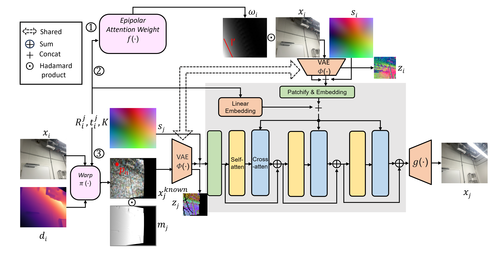

# IJCNN2025-DiT-Multiview
[IJCNN2025] Multi-view Geometry-Aware Diffusion Transformer for Novel View Synthesis of Indoor Scenes

## Introduction
This repository contains the implementation of our IJCNN paper: Multi-view Geometry-Aware Diffusion Transformer for Novel View Synthesis of Indoor Scenes. Our model is designed to incorporate several geometric guidance into [DiT](https://www.wpeebles.com/DiT) to perform indoor novel view synthesis.

## System Overview

## Code Architecture

- Geometric guidance comprises Ray Embedding, RT Embedding, and Epipolar Cross Attention.
- The warp function is implemented in `diffusion/gaussian_diffusion.py`, inpainting only the unknown regions and leaving known regions unchanged.
- Training, sampling, and model foundation follow the original DiT architecture.
